# Enterprise Network Segmentation & Firewall Lab

A hands-on network security lab designed to simulate segmentation of an enterprise environment using **pfSense, VirtualBox, Ubuntu Server, isolated network segments, firewall policies, and network traffic validation**.

The lab separates systems into dedicated **User, Server, and Management networks**, with pfSense acting as the central firewall and gateway. The project focuses on designing segmented network architecture, configuring secure communication policies, validating connectivity, and troubleshooting real-world networking issues.

## Project Objectives

- Build a segmented virtual network using **pfSense and VirtualBox**
- Separate **User, Server, and Management** systems into dedicated network segments
- Configure gateway addressing and network services for each segment
- Implement **pfSense firewall rules** to control permitted network traffic
- Configure static network settings on Ubuntu systems using **Netplan**
- Validate network and gateway connectivity from multiple network segments
- Troubleshoot addressing, routing, DNS, VirtualBox, and Netplan configuration issues
- Document the implementation and results as a reproducible security lab

## Network Architecture

The lab uses **pfSense as the central firewall and Layer 3 gateway** between multiple isolated VirtualBox network segments. Each segment represents a different security zone within a simplified enterprise environment.

| Network Zone | Subnet | Gateway | Purpose |
|---|---|---|---|
| User Network | `192.168.10.0/24` | `192.168.10.1` | Represents employee/user endpoints |
| Server Network | `192.168.20.0/24` | `192.168.20.1` | Represents internal servers and protected resources |
| Management Network | `192.168.99.0/24` | `192.168.99.1` | Dedicated network for administrative access |
| WAN | `10.0.2.0/24` | DHCP | Provides upstream connectivity through VirtualBox NAT |

### Lab Topology

```text
                         Internet
                            |
                     VirtualBox NAT
                            |
                      [ pfSense WAN ]
                         10.0.2.15
                            |
              +-------------+-------------+
              |             |             |
              |             |             |
        User Network   Server Network   Management Network
       192.168.10.0/24 192.168.20.0/24 192.168.99.0/24
              |             |             |
        192.168.10.1   192.168.20.1   192.168.99.1
          pfSense         pfSense         pfSense
              |             |
          USER_VM       SERVER_VM
       192.168.10.50   192.168.20.50
```

This architecture separates systems based on their function rather than placing all hosts on a single flat network. pfSense provides the gateway between each network and allows firewall policies to be applied at the boundaries between security zones.

## Lab Environment & Technologies

| Technology | Role in the Lab |
|---|---|
| **pfSense CE 2.8.1** | Central firewall, gateway, interface management, DHCP, and traffic-control policies |
| **Oracle VirtualBox** | Virtualization platform used to build and isolate the lab environment |
| **Ubuntu Server** | Used for the User and Server systems placed on separate network segments |
| **Netplan** | Configured static IP addressing, default routes, and DNS settings on Ubuntu |
| **TCP/IP** | Provided addressing and communication across the virtual networks |
| **DHCP** | Used to provide network configuration to hosts where applicable |
| **DNS** | Permitted through firewall rules for name-resolution services |
| **NTP** | Permitted through firewall rules for time synchronization |
| **ICMP / Ping** | Used to validate host-to-gateway connectivity and troubleshoot network issues |
| **pfSense Firewall Rules** | Controlled traffic permitted from the segmented networks |

### Virtual Machines

The environment was built entirely in **VirtualBox**, allowing multiple isolated networks to be created without requiring physical networking hardware.

The primary virtual systems included:

- **pfSense Firewall** — connected to the WAN, User, Server, and Management networks
- **USER_VM** — Ubuntu system representing a standard user endpoint on `192.168.10.0/24`
- **SERVER_VM** — Ubuntu system representing an internal server on `192.168.20.0/24`

pfSense was configured with multiple virtual network interfaces so that each security zone had its own gateway and could be governed independently through firewall policies.

## Implementation

### 1. pfSense Firewall Deployment

I deployed **pfSense CE as a dedicated virtual firewall** in VirtualBox to provide routing and security controls between the isolated network segments.

During the initial deployment, I:

- Created a dedicated pfSense virtual machine
- Attached the pfSense installation ISO
- Configured the WAN interface using VirtualBox NAT
- Added separate virtual interfaces for the internal network segments
- Installed pfSense and completed the initial interface configuration
- Assigned IP addresses to each internal gateway

The completed pfSense deployment provided the following gateway interfaces:

| Interface | IP Address | Security Zone |
|---|---|---|
| WAN | `10.0.2.15/24` | External / Upstream |
| LAN | `192.168.10.1/24` | User Network |
| OPT1 | `192.168.20.1/24` | Server Network |
| OPT2 | `192.168.99.1/24` | Management Network |

#### pfSense Installation

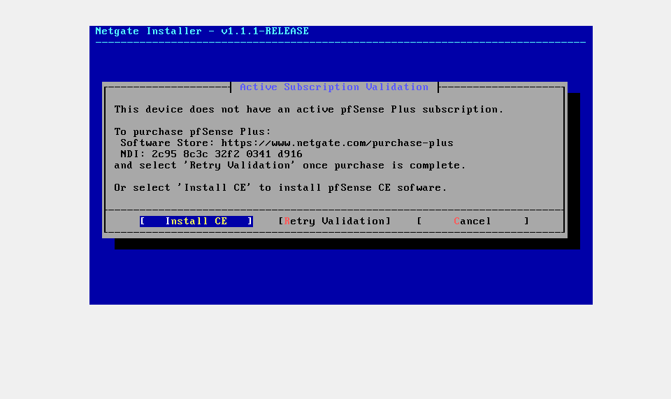

#### Final Interface Configuration

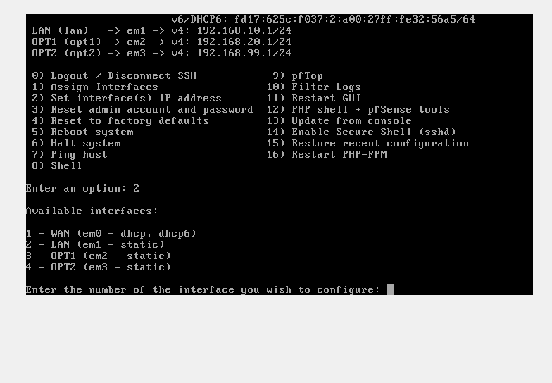

The resulting configuration gives each internal security zone a dedicated Layer 3 gateway while keeping the networks logically separated through pfSense.

### 2. Virtual Network Segmentation

To simulate an enterprise network, I created separate **VirtualBox internal networks** and connected them to dedicated pfSense interfaces.

This design prevents the User, Server, and Management systems from existing on the same flat Layer 2 network. Traffic that needs to move between the isolated networks must pass through pfSense, where firewall policies can control communication.

The primary network segments were:

| Virtual Network | Subnet | Connected System |
|---|---|---|
| User Network | `192.168.10.0/24` | USER_VM |
| Server Network | `192.168.20.0/24` | SERVER_VM |
| Management Network | `192.168.99.0/24` | Administrative / management segment |

Each VM was attached to the appropriate VirtualBox network, while pfSense maintained an interface within each segment.

#### VirtualBox Network Configuration

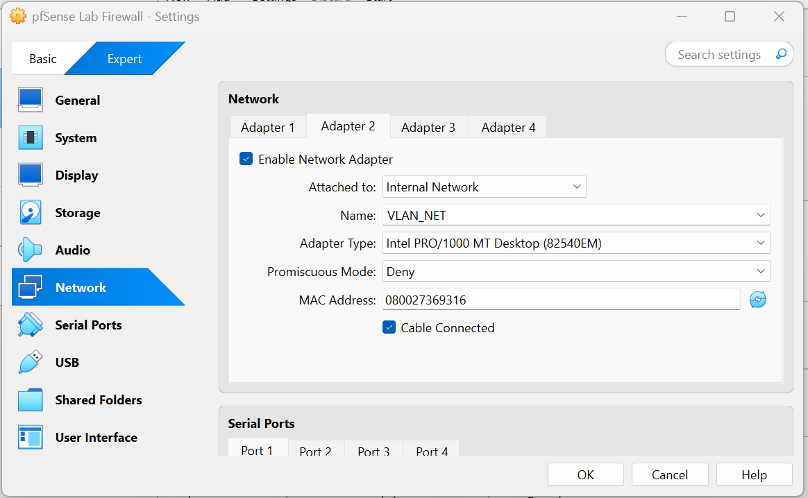

#### User VM Network Adapter

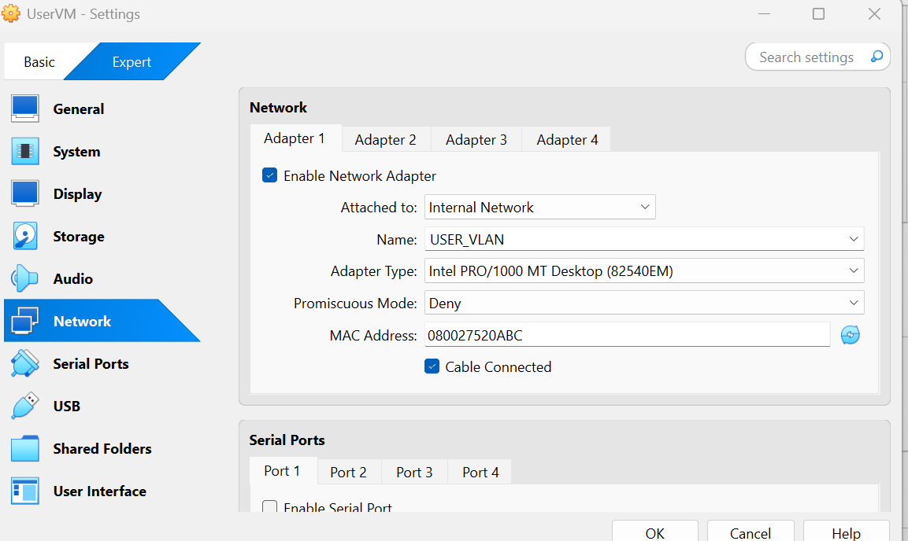

#### Server VM Network Adapter

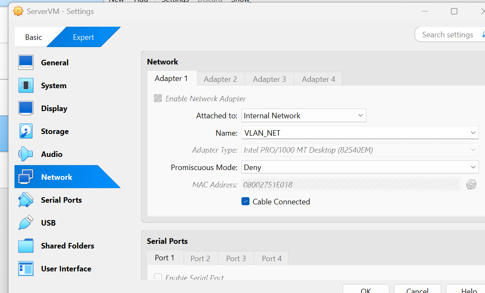

This architecture creates distinct trust zones and provides a foundation for applying security policies between user endpoints, internal servers, and management systems.
### 3. IP Addressing & Network Services

After establishing the network segments, I configured IP addressing and network services so that each zone operated within its assigned subnet.

The addressing scheme was designed to make each security zone easy to identify:

| System / Interface | IP Address | Network |
|---|---|---|
| pfSense User Gateway | `192.168.10.1/24` | User Network |
| USER_VM | `192.168.10.50/24` | User Network |
| pfSense Server Gateway | `192.168.20.1/24` | Server Network |
| SERVER_VM | `192.168.20.50/24` | Server Network |
| pfSense Management Gateway | `192.168.99.1/24` | Management Network |

I also configured network services through pfSense, including **DHCP**, and defined firewall permissions for essential services such as **DNS and NTP**.

#### pfSense Interface Addressing

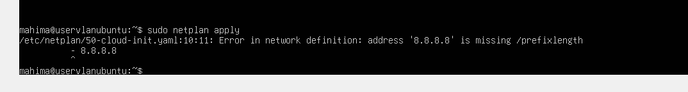

#### User Network DHCP Configuration

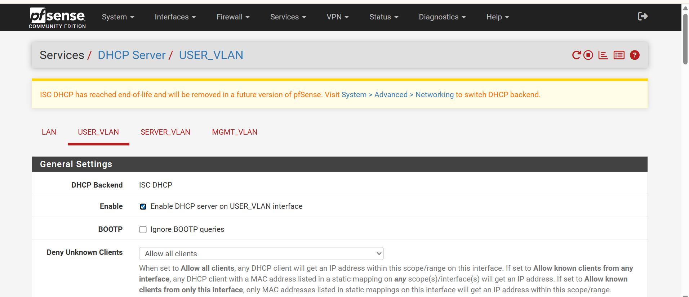

#### User VM Addressing

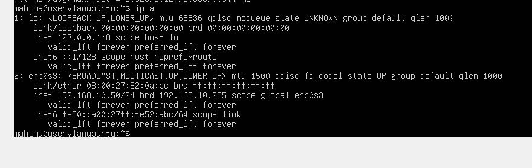

#### Server VM Addressing

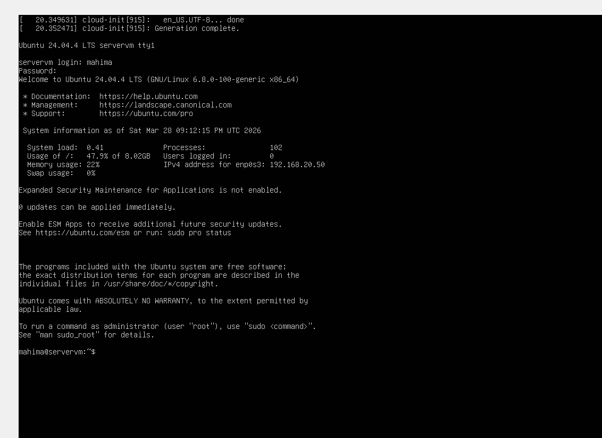

This addressing structure provides predictable network placement and makes it easier to apply security policies based on the source and destination network.
### 4. Firewall Policy & Traffic Control

With the network segments established, I configured **pfSense firewall rules** to control the traffic permitted from the User network.

Rather than allowing unrestricted communication, the rules were designed to permit specific network services required by the client while allowing pfSense to enforce policy at the network boundary.

The configured rules included:

| Service | Purpose |
|---|---|
| **DHCP** | Allows clients to obtain required network configuration |
| **DNS** | Allows clients to perform domain-name resolution |
| **NTP** | Allows clients to synchronize system time |

This rule set applies a least-privilege approach by explicitly permitting required network services rather than using a broad allow rule.

#### User Network Firewall Rules

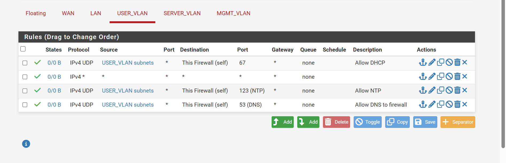

#### Firewall Rule Configuration

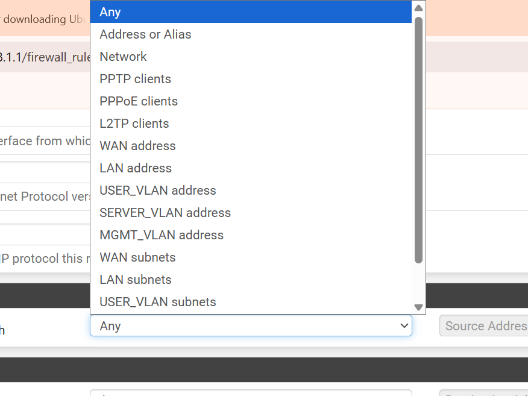

The firewall policy provides a centralized control point for traffic originating from the User network and demonstrates how network segmentation can be combined with firewall rules to reduce unnecessary communication between security zones.
### 5. Ubuntu & Netplan Configuration

After configuring the pfSense interfaces and network segments, I configured the Ubuntu virtual machines with static network settings using **Netplan**.

Static addressing ensured that the User and Server systems remained at predictable addresses within their assigned security zones:

- **USER_VM:** `192.168.10.50/24`
- **Default Gateway:** `192.168.10.1`
- **SERVER_VM:** `192.168.20.50/24`
- **Default Gateway:** `192.168.20.1`

The Netplan configuration defined the interface address, default route, and DNS resolver settings required for network communication.

#### Netplan Static IP Configuration

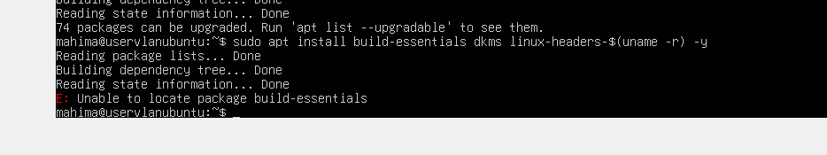

#### Server VM Netplan Applied

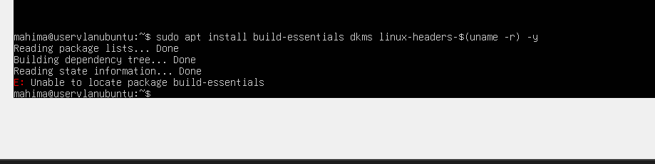

After applying the configuration, I verified the assigned addresses and tested connectivity to the corresponding pfSense gateways.

Using static addressing for the lab endpoints made firewall testing and troubleshooting more predictable because each system maintained a known IP address within its security zone.
### 6. Connectivity Testing & Validation

After configuring pfSense, the virtual network interfaces, and the Ubuntu systems, I performed connectivity tests to verify that the hosts were correctly connected to their respective network segments.

I used **ICMP echo requests (`ping`)** to validate communication between each Ubuntu VM and its assigned pfSense gateway.

#### User Network Gateway Test

The USER_VM successfully reached the User network gateway at `192.168.10.1`.

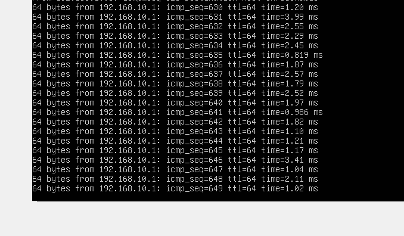

#### Server Network Gateway Test

The SERVER_VM successfully reached the Server network gateway at `192.168.20.1`.

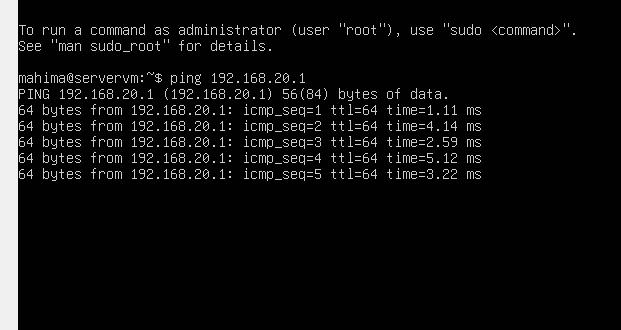

#### Internet Connectivity Test

Additional connectivity testing was performed to verify upstream network access through the virtualized environment.

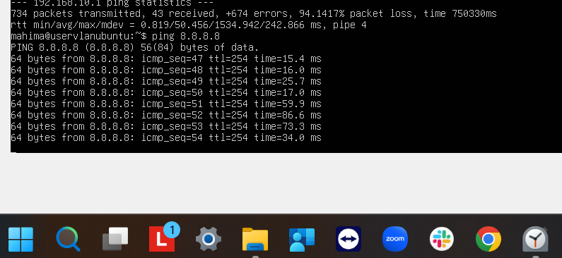

These tests confirmed that the virtual machines were correctly attached to their intended network segments and could communicate with their respective pfSense gateway interfaces.
### 7. Troubleshooting & Lessons Learned

Building the environment required troubleshooting several networking and system-configuration issues. Documenting these failures was an important part of the lab because it demonstrated how configuration errors can affect connectivity and how they can be systematically isolated and corrected.

#### Netplan DNS Configuration Error

During static IP configuration, I initially entered the DNS server incorrectly within the Netplan configuration. Netplan rejected the configuration because the value was interpreted as an interface address without a CIDR prefix.

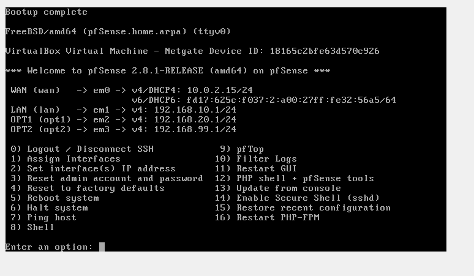

I corrected the configuration by defining the DNS resolver under the `nameservers` section:
```yaml
nameservers:
  addresses:
    - 8.8.8.8
```

**Lesson learned:** YAML structure and indentation are critical in Netplan, and DNS servers must be defined separately from interface IP addresses.

#### Default Gateway Configuration

I also encountered an error when configuring the default gateway with `gateway4`. I resolved the issue by defining the default route explicitly:

```yaml
routes:
  - to: default
    via: 192.168.10.1
```

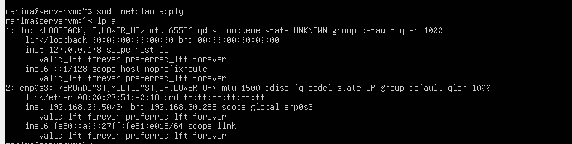

**Lesson learned:** When a configuration directive is unsupported or problematic, defining the routing behavior explicitly can provide a clearer and more compatible configuration.

#### Initial Gateway Connectivity Failure

During connectivity testing, the Server VM initially could not reach its pfSense gateway.

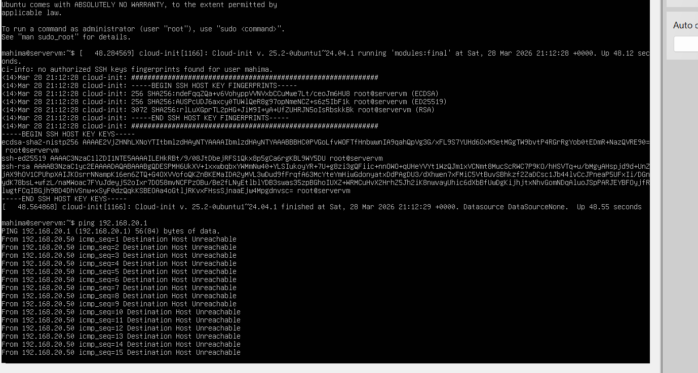

I reviewed the VM network attachment, IP configuration, subnet, and gateway settings until the Server VM was correctly placed on the Server network. After correcting the configuration, connectivity to `192.168.20.1` succeeded.


**Lesson learned:** Troubleshooting network connectivity should be approached layer by layer—starting with interface state and addressing, then verifying subnet placement, gateway configuration, and firewall behavior.

#### VirtualBox Guest Additions Troubleshooting

While configuring the Ubuntu environment, I also encountered issues with VirtualBox Guest Additions, including a missing `vboxservice` service and installation media/mount problems.

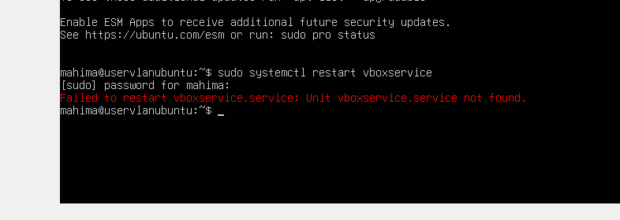

Rather than treating these errors as network failures, I verified the loaded VirtualBox modules separately from the VM's network configuration.

**Lesson learned:** Not every VM-related error is a networking problem. Separating virtualization-tool issues from TCP/IP troubleshooting helps avoid changing otherwise-correct network settings.

### Key Takeaways

Through the troubleshooting process, I strengthened my understanding of:

- Static IPv4 addressing and subnet configuration
- Default routes and gateway behavior
- DNS configuration in Netplan
- YAML syntax and indentation
- VirtualBox network adapter placement
- pfSense interface configuration
- Layered network troubleshooting
- The importance of validating configuration changes with connectivity tests

## Results & Security Outcomes

The completed lab established a functional segmented network environment with **pfSense acting as the central firewall and gateway** between separate User, Server, and Management security zones.

### Final Results

- Established separate **User (`192.168.10.0/24`)**, **Server (`192.168.20.0/24`)**, and **Management (`192.168.99.0/24`)** network segments
- Configured dedicated pfSense gateway interfaces for each internal network
- Assigned predictable static addresses to the Ubuntu User and Server systems
- Configured essential network services including **DHCP, DNS, and NTP**
- Implemented pfSense firewall rules to control permitted traffic from the User network
- Successfully validated USER_VM connectivity to the `192.168.10.1` gateway
- Successfully validated SERVER_VM connectivity to the `192.168.20.1` gateway
- Verified upstream connectivity through the virtualized network environment
- Diagnosed and resolved Netplan, routing, addressing, VirtualBox, and connectivity issues encountered during deployment

#### Final pfSense Interface State


The final environment demonstrates how **network segmentation and centralized firewall policy** can be used to organize systems into separate trust zones and provide controlled network boundaries instead of relying on a single flat network.

## Skills Demonstrated

- **Network Security:** Network segmentation, security zones, firewall policy, least-privilege network access
- **Firewall Administration:** pfSense deployment, interface configuration, DHCP, and firewall rules
- **Networking:** TCP/IP, IPv4 addressing, subnetting, default gateways, routing, DHCP, DNS, NTP, and ICMP
- **Virtualization:** VirtualBox virtual machines, NAT, internal networks, and virtual network adapters
- **Linux Networking:** Ubuntu Server, Netplan, static IP configuration, DNS configuration, and routing
- **Troubleshooting:** Connectivity testing, configuration validation, gateway troubleshooting, YAML debugging, and systematic network diagnosis
- **Documentation:** Technical screenshots, architecture documentation, implementation notes, and troubleshooting evidence