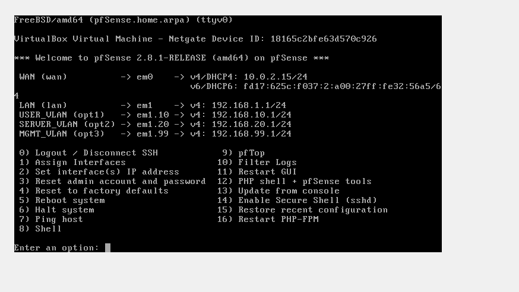
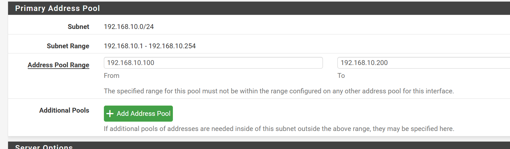
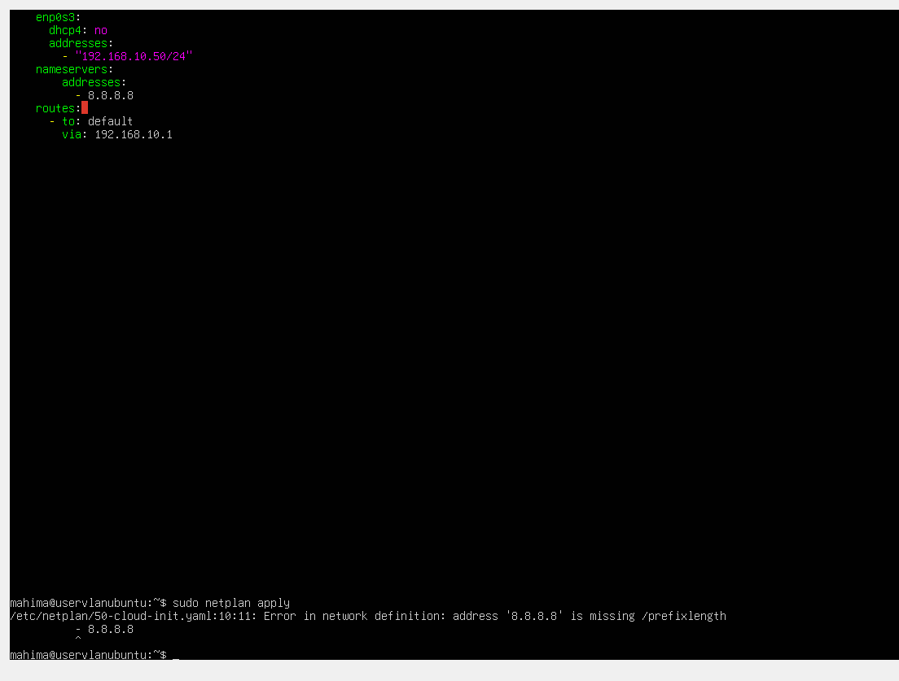
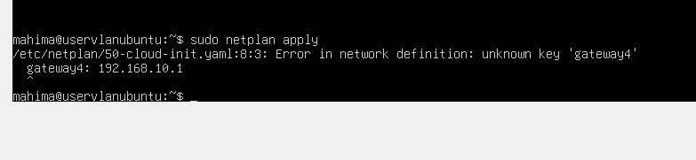

# Enterprise Network Segmentation & Firewall Lab

A hands-on network security lab designed to simulate segmentation of an enterprise environment using **pfSense, VirtualBox, Ubuntu Linux, isolated network segments, firewall policies, and network traffic validation**.

The lab establishes dedicated User, Server, and Management network segments, with pfSense acting as the central firewall and gateway. The project focuses on designing segmented network architecture, configuring secure communication policies, validating host-to-gateway connectivity, and troubleshooting real-world networking issues.

## Project Objectives

- Build a segmented virtual network using **pfSense and VirtualBox**
- Establish dedicated **User, Server, and Management** network segments
- Configure gateway addressing and network services for each segment
- Implement **pfSense firewall rules** to control permitted network traffic
- Configure static network settings on Ubuntu systems using **Netplan**
- Validate host-to-gateway connectivity from the User and Server network segments
- Troubleshoot addressing, routing, DNS, virtual network attachment, and Netplan configuration issues
- Document the implementation and results as a reproducible security lab

## Network Architecture

The lab uses **pfSense as the central firewall and Layer 3 gateway** between multiple isolated VirtualBox network segments. Each segment represents a different security zone within a simplified enterprise environment.

| Network Zone | Subnet | Gateway | Purpose |
|---|---|---|---|
| User Network | `192.168.10.0/24` | `192.168.10.1` | Represents employee/user endpoints |
| Server Network | `192.168.20.0/24` | `192.168.20.1` | Represents internal servers and protected resources |
| Management Network | `192.168.99.0/24` | `192.168.99.1` | Dedicated network for administrative access |
| WAN | `10.0.2.0/24` | DHCP | Provides upstream connectivity through VirtualBox NAT |

### Lab Topology

```text
                         Internet
                            |
                     VirtualBox NAT
                            |
                      [ pfSense WAN ]
                         10.0.2.15
                            |
              +-------------+-------------+
              |             |             |
              |             |             |
        User Network   Server Network   Management Network
       192.168.10.0/24 192.168.20.0/24 192.168.99.0/24
              |             |             |
        192.168.10.1   192.168.20.1   192.168.99.1
          pfSense         pfSense         pfSense
              |             |
          USER_VM       SERVER_VM
       192.168.10.50   192.168.20.50
```

This architecture separates systems based on their function rather than placing all hosts on a single flat network. pfSense provides a dedicated gateway for each network segment and serves as the central point where firewall policies can be applied to traffic crossing security-zone boundaries.

## Lab Environment & Technologies

| Technology | Role in the Lab |
|---|---|
| **pfSense CE 2.8.1** | Central firewall, gateway, interface management, DHCP, and traffic-control policies |
| **Oracle VirtualBox** | Virtualization platform used to build and isolate the lab environment |
| **Ubuntu Linux** | Used for the User and Server systems placed on separate network segments |
| **Netplan** | Configured static IP addressing, default routes, and DNS settings on Ubuntu |
| **TCP/IP** | Provided addressing and communication across the virtual networks |
| **DHCP** | Used to provide network configuration to hosts where applicable |
| **DNS** | Permitted through firewall rules for name-resolution services |
| **NTP** | Permitted through firewall rules for time synchronization |
| **ICMP / Ping** | Used to validate host-to-gateway connectivity and troubleshoot network issues |
| **pfSense Firewall Rules** | Controlled traffic permitted from the segmented networks |

### Virtual Machines

The environment was built entirely in **VirtualBox**, allowing multiple isolated networks to be created without requiring physical networking hardware.

The primary virtual systems included:

- **pfSense Firewall** — connected to the WAN, User, Server, and Management networks
- **USER_VM** — Ubuntu system representing a standard user endpoint on `192.168.10.0/24`
- **SERVER_VM** — Ubuntu system representing an internal server on `192.168.20.0/24`

pfSense was configured with multiple virtual network interfaces so that each security zone had its own gateway and a centralized point where firewall policies could be applied.

## Implementation

### 1. pfSense Firewall Deployment

I deployed **pfSense CE as a dedicated virtual firewall** in VirtualBox to provide routing and security controls between the isolated network segments.

During the initial deployment, I:

- Created a dedicated pfSense virtual machine
- Attached the pfSense installation ISO
- Configured the WAN interface using VirtualBox NAT
- Added separate virtual interfaces for the internal network segments
- Installed pfSense and completed the initial interface configuration
- Assigned IP addresses to each internal gateway

The completed pfSense deployment provided the following gateway interfaces:

| Interface | IP Address | Security Zone |
|---|---|---|
| WAN | `10.0.2.15/24` | External / Upstream |
| LAN | `192.168.10.1/24` | User Network |
| OPT1 | `192.168.20.1/24` | Server Network |
| OPT2 | `192.168.99.1/24` | Management Network |

#### pfSense Installation


#### Final Interface Configuration



The resulting configuration gives each internal security zone a dedicated Layer 3 gateway while maintaining separation through dedicated virtual network interfaces.

### 2. Virtual Network Segmentation

To simulate an enterprise network, I created separate **VirtualBox internal networks** and connected them to dedicated pfSense interfaces.

This design places the User, Server, and Management network segments on separate virtual networks rather than a single flat Layer 2 network. Traffic between these isolated networks must pass through pfSense, where firewall policies can control communication.

The primary network segments were:

| Virtual Network | Subnet | Connected System |
|---|---|---|
| User Network | `192.168.10.0/24` | USER_VM |
| Server Network | `192.168.20.0/24` | SERVER_VM |
| Management Network | `192.168.99.0/24` | Administrative / management segment |

Each VM was attached to the appropriate VirtualBox network, while pfSense maintained an interface within each segment.

#### User VM Network Adapter


This architecture creates distinct trust zones and provides a foundation for applying security policies between user endpoints, internal servers, and management systems.

### 3. IP Addressing & Network Services

After establishing the network segments, I configured IP addressing and network services so that each zone operated within its assigned subnet.

The addressing scheme was designed to make each security zone easy to identify:

| System / Interface | IP Address | Network |
|---|---|---|
| pfSense User Gateway | `192.168.10.1/24` | User Network |
| USER_VM | `192.168.10.50/24` | User Network |
| pfSense Server Gateway | `192.168.20.1/24` | Server Network |
| SERVER_VM | `192.168.20.50/24` | Server Network |
| pfSense Management Gateway | `192.168.99.1/24` | Management Network |

I also configured network services through pfSense, including **DHCP**, and defined firewall permissions for essential services such as **DNS and NTP**.

#### User Network DHCP Configuration



#### User VM Addressing


#### Server VM Addressing


This addressing structure provides predictable endpoint placement within each subnet and supports firewall policies based on source and destination networks.

### 4. Firewall Policy & Traffic Control

With the network segments established, I configured **pfSense firewall rules** to control the traffic permitted from the User network.

Rather than relying only on unrestricted communication, I configured service-specific rules for required network traffic, allowing pfSense to enforce traffic-control policies at the network boundary.

The configured rules included:

| Service | Purpose |
|---|---|
| **DHCP** | Allows clients to obtain required network configuration |
| **DNS** | Allows clients to perform domain-name resolution |
| **NTP** | Allows clients to synchronize system time |

The service-specific rules were configured to explicitly permit required network services such as DHCP, DNS, and NTP, demonstrating how pfSense can enforce granular traffic-control policies at the network boundary.

#### User Network Firewall Rules


The firewall policy provides a centralized control point for traffic originating from the User network and demonstrates how network segmentation can be combined with firewall rules to define permitted traffic at security-zone boundaries.

### 5. Ubuntu & Netplan Configuration

After configuring the pfSense interfaces and network segments, I configured the Ubuntu virtual machines with static network settings using **Netplan**.

Static addressing ensured that the User and Server systems remained at predictable addresses within their assigned security zones:

- **USER_VM:** `192.168.10.50/24`
- **Default Gateway:** `192.168.10.1`
- **SERVER_VM:** `192.168.20.50/24`
- **Default Gateway:** `192.168.20.1`

The Netplan configuration defined the interface address, default route, and DNS resolver settings required for network communication.

#### Netplan Static IP Configuration


After applying the configuration, I verified the assigned addresses and tested connectivity to the corresponding pfSense gateways.

Using static addressing for the lab endpoints made firewall testing and troubleshooting more predictable because each system maintained a known IP address within its security zone.

### 6. Connectivity Testing & Validation

After configuring the network interfaces and static IP addressing, I tested connectivity from the Ubuntu virtual machines to their assigned pfSense gateways.

The validation focused on confirming that each system was connected to the correct network segment and could successfully communicate with its corresponding gateway.

| Test | Source | Destination | Result |
|---|---|---|---|
| User gateway connectivity | USER_VM (`192.168.10.50`) | `192.168.10.1` | Successful |
| Server gateway connectivity | SERVER_VM (`192.168.20.50`) | `192.168.20.1` | Successful |

#### User Network Gateway Test


#### Server Network Gateway Test


Successful gateway communication confirmed that the virtual network attachments, static IP configurations, and pfSense gateway interfaces were functioning correctly for both network segments.

### 7. Troubleshooting & Lessons Learned

Building the environment required troubleshooting several networking and system-configuration issues. Documenting these failures was an important part of the lab because it demonstrated how configuration errors can affect connectivity and how they can be systematically isolated and corrected.

#### Netplan DNS Configuration Error

While configuring static addressing on the Ubuntu User VM, I initially placed the DNS resolver address (`8.8.8.8`) incorrectly within the Netplan configuration.

When applying the configuration, Netplan returned an error indicating that the address was missing a CIDR prefix length.



I corrected the configuration by placing the DNS server under the `nameservers` section while keeping the interface IP address under `addresses`.

This reinforced the importance of YAML structure and indentation when configuring Linux networking through Netplan.

#### Netplan Default Gateway Configuration Error

A second issue occurred when configuring the default gateway using the `gateway4` directive. When I applied the configuration, Netplan returned an **"unknown key 'gateway4'"** error.



I resolved the issue by replacing `gateway4` with an explicit default route using the `routes` section:

```yaml
routes:
  - to: default
    via: 192.168.10.1
```
After correcting the configuration, Netplan was able to apply the static network settings successfully.

This troubleshooting step reinforced my understanding of Linux routing configuration and how Netplan syntax can vary depending on the configuration schema and system environment.

#### Initial Gateway Connectivity Failure

During connectivity testing, the Server VM initially could not reach its pfSense gateway.


I reviewed the VM network attachment, IP configuration, subnet, and gateway settings until the Server VM was correctly attached to its intended Server network segment. After correcting the configuration, connectivity to `192.168.20.1` succeeded.


**Lesson learned:** Troubleshooting network connectivity should be approached layer by layer—starting with interface state and addressing, then verifying subnet placement, gateway configuration, and firewall behavior.

### Key Takeaways

Through the troubleshooting process, I strengthened my understanding of:

- Static IPv4 addressing and subnet configuration
- Default routes and gateway behavior
- DNS configuration in Netplan
- YAML syntax and indentation
- VirtualBox internal network and adapter configuration
- pfSense interface configuration
- Layered network troubleshooting
- The importance of validating configuration changes with connectivity tests

## Results & Security Outcomes

The completed lab established a functional segmented network environment with **pfSense acting as the central firewall and gateway** for separate User, Server, and Management security zones.

### Final Results

- Established separate **User (`192.168.10.0/24`)**, **Server (`192.168.20.0/24`)**, and **Management (`192.168.99.0/24`)** network segments
- Configured dedicated pfSense gateway interfaces for each internal network
- Assigned predictable static addresses to the Ubuntu User and Server systems
- Configured DHCP services and firewall permissions for essential DNS and NTP traffic
- Implemented pfSense firewall rules to control permitted traffic from the User network
- Successfully validated USER_VM connectivity to the `192.168.10.1` gateway
- Successfully validated SERVER_VM connectivity to the `192.168.20.1` gateway
- Diagnosed and resolved Netplan, routing, addressing, virtual network attachment, and connectivity issues encountered during deployment

The final environment demonstrates how **network segmentation and centralized firewall policy** can be used to organize systems into separate trust zones and provide controlled network boundaries instead of relying on a single flat network.

## Skills Demonstrated

- **Network Security:** Network segmentation, security zones, firewall policy, and traffic-control principles
- **Firewall Administration:** pfSense deployment, multi-interface configuration, DHCP services, and firewall rule configuration
- **Networking:** TCP/IP, IPv4 addressing, subnetting, default gateways, routing, DHCP, DNS, NTP, and ICMP
- **Virtualization:** VirtualBox virtual machines, NAT networking, isolated internal networks, and virtual network adapter configuration
- **Linux Networking:** Ubuntu, Netplan, static IPv4 addressing, interface configuration, DNS, and default-route configuration
- **Troubleshooting:** Connectivity testing, configuration validation, Netplan/YAML debugging, gateway troubleshooting, and systematic network diagnosis
- **Documentation:** Technical screenshots, architecture documentation, implementation notes, and troubleshooting evidence